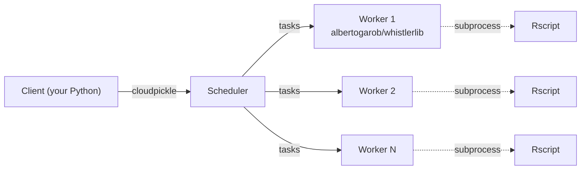

<!--
  Logo is served via the live docs site (GitHub Pages CDN). Absolute
  URL so the image renders on PyPI's project page too (PyPI's long-
  description renderer does not follow relative paths). Updates
  automatically whenever the website redeploys.
-->
<p align="center">
  
</p>

<p align="center">
  <b>Distributed social-network and NLP analytics for X / Twitter datasets, on Dask.</b>
</p>

<p align="center">
  Hashtag, mention, and n-gram histograms; sentiment ranges; emotion vectors; co-occurrence networks. Python or R implementations on Dask, in one <code>albertogarob/whistlerlib</code> Docker image.
</p>

<p align="center">
  <a href="https://whistlerlib.observatoriogeo.mx"></a>
  <a href="https://pypi.org/project/whistlerlib/"></a>
  <a href="https://pypi.org/project/whistlerlib/"></a>
  <a href="LICENSE"></a>
</p>

---

[**Whistlerlib**](https://whistlerlib.observatoriogeo.mx), developed by the [Observatorio Metropolitano CentroGeo](https://observatoriogeo.mx) at [CentroGeo](https://www.centrogeo.org.mx/), turns a [Dask](https://www.dask.org/) cluster into a distributed analytical engine for large social-media datasets. A single analytical query (top-`k` hashtags, weighted co-occurrence networks, Spanish sentiment ranges, …) fans out across a cluster of workers and comes back as a pandas `DataFrame` or an `igraph.Graph`.

It's aimed at:

- **Computational social scientists** working with X / Twitter (or similar) corpora that have outgrown a single-process pandas workflow.
- **Quantitative humanities and digital-methods researchers** who want SNA + NLP primitives without writing Dask `map_partitions` boilerplate.
- **Data engineers** who already deploy a small Dask cluster (Compose or Swarm) and want a thin, opinionated analytical layer on top of it.

## Status

Current release: **`0.2.0`**. Runs on Python 3.11+, Dask 2026.3.x, pandas 2.x, igraph, nltk, sklearn, and (optionally, via the worker Docker image) R 4.x.

| Surface | State |
|---|---|
| Source layout | `src/whistlerlib/` (PEP 621, hatchling, [`uv.lock`](https://github.com/observatoriogeo/whistlerlib/blob/main/uv.lock) committed) |
| Tests | 119 unit tests (97 % coverage) + 7 docker-backed integration tests, all green |
| Docs | Live at [whistlerlib.observatoriogeo.mx](https://whistlerlib.observatoriogeo.mx) (Docusaurus 3.10, source under [`website/`](https://github.com/observatoriogeo/whistlerlib/tree/main/website)) |
| Examples | 7 runnable end-to-end examples under [`examples/`](https://github.com/observatoriogeo/whistlerlib/blob/main/examples/) |
| Docker image | [`albertogarob/whistlerlib`](https://hub.docker.com/r/albertogarob/whistlerlib) on Docker Hub: `0.2.0`, `0.2`, `latest` (multi-arch: `linux/amd64` + `linux/arm64`) |
| PyPI | GitHub release only; PyPI publish planned |

Full release notes in [`CHANGELOG.md`](https://github.com/observatoriogeo/whistlerlib/blob/main/CHANGELOG.md); upgrade path from 0.1.0 in the [migration guide](https://whistlerlib.observatoriogeo.mx/docs/migration/from-0.1.0).

## What it does

| Analytic family | Pure-Python | R-bridge |
|---|---|---|
| Hashtag histogram | `hashtag_histogram_alt_python` | `hashtag_histogram_r` |
| Mention histogram | `mention_histogram_alt_python` | `mention_histogram_r` |
| N-gram histogram | `ngram_histogram_alt_python` | `ngram_histogram_r` |
| Spanish sentiment range | `sentiment_range_spanish_alt_python` | (n/a) |
| Emotion vectors (Syuzhet) | (n/a) | `sentiment_histogram_and_sum_r` |
| Hashtag co-occurrence network | `hashtag_weighted_coonet` | (n/a) |
| Mention co-occurrence network | `mention_weighted_coonet` | (n/a) |

Pure-Python methods wrap `advertools`, `nltk`, `sklearn`, and `sentiment-analysis-spanish`. R-bridge methods shell out to `Rscript` (via the `tm`, `RWeka`, `syuzhet`, and `radvertools` R packages) running inside the published `albertogarob/whistlerlib` Docker image; the host never installs R.

See [Algorithm families](https://whistlerlib.observatoriogeo.mx/docs/concepts/algorithm-families) for the dispatch story.

## Quickstart

Against a Dask cluster reachable at `localhost:8786`:

```python
from whistlerlib import Context

ctx = Context('processes', 'localhost', 8786)

ds = ctx.load_csv(
    filen='posts.csv',
    meta={
        'column_mapping': {'date_column': 'Date', 'text_column': 'text'},
        'file_encoding': 'utf-8',
    },
    num_partitions=8,
)

print(f'Loaded {ds.tweet_count()} posts.')
print(ds.hashtag_histogram_alt_python(k=5))
```

Full walkthrough including how to bring up the cluster: [Tutorial 01](https://whistlerlib.observatoriogeo.mx/docs/tutorials/01-quickstart-hashtag-histogram).

## Install

### Client (Python)

```bash
pip install whistlerlib
```

> If you use [uv](https://docs.astral.sh/uv/): `uv pip install whistlerlib`.

(PyPI publish is pending; until then, install from a clone: `pip install -e .` from the repo root.)

A pip install gives you the **pure-Python** algorithm surface. R-bridge methods require the worker Docker image.

### Cluster (Docker)

Single-host development cluster:

```bash
docker compose -f docker/docker-compose.yml up -d
# Scheduler:  tcp://localhost:8786
# Dashboard:  http://localhost:8787
```

Multi-node production cluster on Docker Swarm:

```bash
VERSION=0.2.0 docker stack deploy -c docker/stack.yml whistlerlib
```

Full Swarm setup (initialization, node labelling, image distribution, shared storage, scaling): [Install with Docker](https://whistlerlib.observatoriogeo.mx/docs/installation/docker).

## Architecture



Both the scheduler ("master") and the workers run the same `albertogarob/whistlerlib` image; the scheduler service overrides the `ENTRYPOINT` to `dask-scheduler`. This keeps the Python environments consistent across client / scheduler / workers (a Dask requirement for task-graph serialization). R lives only inside the worker image.

See [Architecture](https://whistlerlib.observatoriogeo.mx/docs/concepts/architecture) for the full picture.

## Documentation

All documentation lives at **[whistlerlib.observatoriogeo.mx](https://whistlerlib.observatoriogeo.mx)**. Highlights:

| Section | Pointer |
|---|---|
| Introduction | [/docs/intro](https://whistlerlib.observatoriogeo.mx/docs/intro) |
| Install (pip) | [/docs/installation/pip](https://whistlerlib.observatoriogeo.mx/docs/installation/pip) |
| Install (Docker / Swarm) | [/docs/installation/docker](https://whistlerlib.observatoriogeo.mx/docs/installation/docker) |
| Architecture | [/docs/concepts/architecture](https://whistlerlib.observatoriogeo.mx/docs/concepts/architecture) |
| `Context` & datasets | [/docs/concepts/context-and-datasets](https://whistlerlib.observatoriogeo.mx/docs/concepts/context-and-datasets) |
| Algorithm families | [/docs/concepts/algorithm-families](https://whistlerlib.observatoriogeo.mx/docs/concepts/algorithm-families) |
| Tutorials (7 examples) | [/docs/tutorials/](https://whistlerlib.observatoriogeo.mx/docs/tutorials/) |
| API reference | [/docs/api/](https://whistlerlib.observatoriogeo.mx/docs/api/) |
| Migration from 0.1.0 | [/docs/migration/from-0.1.0](https://whistlerlib.observatoriogeo.mx/docs/migration/from-0.1.0) |
| Citation | [/docs/citation](https://whistlerlib.observatoriogeo.mx/docs/citation) |

## Development

[`uv`](https://docs.astral.sh/uv/) is the project's package and environment manager (Astral, ~10x faster than pip, ships a reproducible lockfile).

```bash
git clone https://github.com/observatoriogeo/whistlerlib.git
cd whistlerlib
uv sync --extra dev    # creates .venv/, installs deps + dev tools
uv run pytest          # 119 unit tests, ~12 s
```

Plain `pip` + `venv` is supported as a fallback:

```bash
git clone https://github.com/observatoriogeo/whistlerlib.git
cd whistlerlib
python3.11 -m venv .venv
source .venv/bin/activate
pip install -e ".[dev]"
pytest
```

Running the docker-backed integration tests against a real local cluster:

```bash
uv run pytest -m docker tests/integration
```

The `docker` marker is **deselected by default** so a plain `pytest` stays fast and doesn't require Docker. CI runs the docker job on every push to `main` and on manual `workflow_dispatch`.

## Citation

If you use Whistlerlib in your research, please cite:

> Garcia-Robledo, A., Espejel-Trujillo, A. Whistlerlib: a distributed computing library for exploratory data analysis on large social network datasets. *Multimedia Tools and Applications* **83**, 87071–87104 (2024). [https://doi.org/10.1007/s11042-024-19827-z](https://doi.org/10.1007/s11042-024-19827-z)

BibTeX:

```bibtex
@article{garcia2024whistlerlib,
  author  = {Garcia-Robledo, A. and Espejel-Trujillo, A.},
  title   = {Whistlerlib: a distributed computing library for exploratory data analysis on large social network datasets},
  journal = {Multimedia Tools and Applications},
  volume  = {83},
  pages   = {87071--87104},
  year    = {2024},
  doi     = {10.1007/s11042-024-19827-z},
}
```

## License

Whistlerlib is distributed under **GPL-3.0-or-later**. See [LICENSE](https://github.com/observatoriogeo/whistlerlib/blob/main/LICENSE).

## Contact

- Bug reports / feature requests: [GitHub Issues](https://github.com/observatoriogeo/whistlerlib/issues)
- Academic / collaboration: [agarcia@centrogeo.edu.mx](mailto:agarcia@centrogeo.edu.mx)
