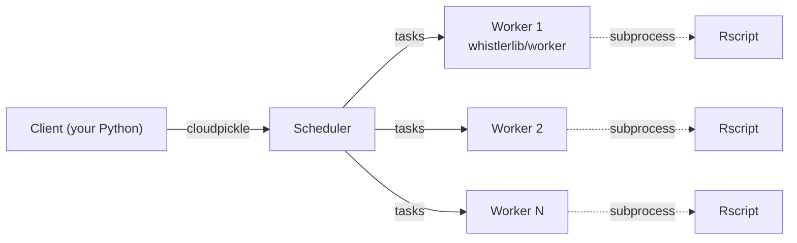

<!--
  Logo path is RELATIVE so it renders on GitHub's web UI (and locally)
  off the modernization branch. PyPI's long-description renderer does
  NOT follow relative paths; Phase 7 should rewrite to an absolute URL
  (e.g. https://raw.githubusercontent.com/observatoriogeo/whistlerlib/
  v0.2.0/docs/_assets/logo.png) before the first publish.
-->
<p align="center">
  
</p>

# Whistlerlib

**Whistlerlib** is a Python library for distributed processing of large social-media datasets, developed at the [CentroGeo](https://www.centrogeo.org.mx/) Metropolitan Observatory. It combines social-network-analysis (SNA) and natural-language-processing (NLP) primitives with a [Dask](https://www.dask.org/)-backed execution model: a single analytical query (top-`k` hashtags, weighted co-occurrence networks, Spanish sentiment ranges, …) fans out across a cluster of workers and returns a pandas `DataFrame` or an `igraph.Graph`.

## Status

The library has been **modernized** from a 2021-2022 codebase to current Python (3.11+), Dask (2026.3), and pandas (2.x). The current development version is `0.2.0` (pre-release).

| Surface | State |
|---|---|
| Source layout | `src/whistlerlib/` (PEP 621, hatchling, [`uv.lock`](https://github.com/observatoriogeo/whistlerlib/blob/main/uv.lock) committed) |
| Tests | 119 unit tests (97 % coverage) + 7 docker-backed integration tests, all green |
| Docs | [`docs/`](https://github.com/observatoriogeo/whistlerlib/blob/main/docs/) tree (renderable on GitHub, portable to Docusaurus) |
| Examples | 7 runnable end-to-end examples under [`examples/`](https://github.com/observatoriogeo/whistlerlib/blob/main/examples/) |
| Docker image | `whistlerlib/worker:<version>` (built locally; Docker Hub publish pending) |
| PyPI | not yet published; release in progress |

Full release notes in [`CHANGELOG.md`](https://github.com/observatoriogeo/whistlerlib/blob/main/CHANGELOG.md); upgrade path from the pre-revival snapshot in [`MIGRATION.md`](https://github.com/observatoriogeo/whistlerlib/blob/main/MIGRATION.md).

## What it does

| Analytic family | Pure-Python | R-bridge |
|---|---|---|
| Hashtag histogram | `hashtag_histogram_alt_python` | `hashtag_histogram_r` |
| Mention histogram | `mention_histogram_alt_python` | `mention_histogram_r` |
| N-gram histogram | `ngram_histogram_alt_python` | `ngram_histogram_r` |
| Spanish sentiment range | `sentiment_range_spanish_alt_python` | (n/a) |
| Emotion vectors (Syuzhet) | (n/a) | `sentiment_histogram_and_sum_r` |
| Hashtag co-occurrence network | `hashtag_weighted_coonet` | (n/a) |
| Mention co-occurrence network | `mention_weighted_coonet` | (n/a) |

Pure-Python methods wrap `advertools`, `nltk`, `sklearn`, and `sentiment-analysis-spanish`. R-bridge methods shell out to `Rscript` (via the `tm`, `RWeka`, `syuzhet`, and `radvertools` R packages) running inside the published `whistlerlib/worker` Docker image; the host never installs R.

See [docs/concepts/algorithm-families.md](https://github.com/observatoriogeo/whistlerlib/blob/main/docs/concepts/algorithm-families.md) for the dispatch story.

## Quickstart

Against a Dask cluster reachable at `localhost:8786`:

```python
from whistlerlib import Context

ctx = Context('processes', 'localhost', 8786)

ds = ctx.load_csv(
    filen='posts.csv',
    meta={
        'column_mapping': {'date_column': 'Date', 'text_column': 'text'},
        'file_encoding': 'utf-8',
    },
    num_partitions=8,
)

print(f'Loaded {ds.tweet_count()} posts.')
print(ds.hashtag_histogram_alt_python(k=5))
```

Full walkthrough including how to bring up the cluster: [Tutorial 01](https://github.com/observatoriogeo/whistlerlib/blob/main/docs/tutorials/01-quickstart-hashtag-histogram.md).

## Install

### Client (Python)

```bash
pip install whistlerlib
```

> If you use [uv](https://docs.astral.sh/uv/): `uv pip install whistlerlib`.

(PyPI publish is pending; until then, install from a clone: `pip install -e .` from the repo root.)

A pip install gives you the **pure-Python** algorithm surface. R-bridge methods require the worker Docker image.

### Cluster (Docker)

Single-host development cluster:

```bash
docker compose -f docker/docker-compose.yml up -d
# Scheduler:  tcp://localhost:8786
# Dashboard:  http://localhost:8787
```

Multi-node production cluster on Docker Swarm:

```bash
VERSION=0.2.0 docker stack deploy -c docker/stack.yml whistlerlib
```

Full Swarm setup (initialization, node labelling, image distribution, shared storage, scaling): [docs/installation/docker.md](https://github.com/observatoriogeo/whistlerlib/blob/main/docs/installation/docker.md).

## Architecture



Both the scheduler ("master") and the workers run the same `whistlerlib/worker` image; the scheduler service overrides the `ENTRYPOINT` to `dask-scheduler`. This keeps the Python environments consistent across client / scheduler / workers (a Dask requirement for task-graph serialization). R lives only inside the worker image.

See [docs/concepts/architecture.md](https://github.com/observatoriogeo/whistlerlib/blob/main/docs/concepts/architecture.md) for the full picture.

## Documentation

| Section | Pointer |
|---|---|
| Introduction | [docs/intro.md](https://github.com/observatoriogeo/whistlerlib/blob/main/docs/intro.md) |
| Install (pip) | [docs/installation/pip.md](https://github.com/observatoriogeo/whistlerlib/blob/main/docs/installation/pip.md) |
| Install (Docker / Swarm) | [docs/installation/docker.md](https://github.com/observatoriogeo/whistlerlib/blob/main/docs/installation/docker.md) |
| Architecture | [docs/concepts/architecture.md](https://github.com/observatoriogeo/whistlerlib/blob/main/docs/concepts/architecture.md) |
| `Context` & datasets | [docs/concepts/context-and-datasets.md](https://github.com/observatoriogeo/whistlerlib/blob/main/docs/concepts/context-and-datasets.md) |
| Algorithm families | [docs/concepts/algorithm-families.md](https://github.com/observatoriogeo/whistlerlib/blob/main/docs/concepts/algorithm-families.md) |
| Tutorials (7 examples) | [docs/tutorials/](https://github.com/observatoriogeo/whistlerlib/blob/main/docs/tutorials/) |
| Migration from pre-revival | [docs/migration/from-pre-revival.md](https://github.com/observatoriogeo/whistlerlib/blob/main/docs/migration/from-pre-revival.md) |

## Development

[`uv`](https://docs.astral.sh/uv/) is the project's package and environment manager (Astral, ~10x faster than pip, ships a reproducible lockfile).

```bash
git clone https://github.com/observatoriogeo/whistlerlib.git
cd whistlerlib
uv sync --extra dev    # creates .venv/, installs deps + dev tools
uv run pytest          # 119 unit tests, ~12 s
```

Plain `pip` + `venv` is supported as a fallback:

```bash
git clone https://github.com/observatoriogeo/whistlerlib.git
cd whistlerlib
python3.11 -m venv .venv
source .venv/bin/activate
pip install -e ".[dev]"
pytest
```

Running the docker-backed integration tests against a real local cluster:

```bash
uv run pytest -m docker tests/integration
```

The `docker` marker is **deselected by default** so a plain `pytest` stays fast and doesn't require Docker. CI runs the docker job on every push to `main` and on manual `workflow_dispatch`.

## License

Whistlerlib is distributed under **GPL-3.0-or-later**. See [LICENSE](https://github.com/observatoriogeo/whistlerlib/blob/main/LICENSE).

## Contact

- Bug reports / feature requests: [GitHub Issues](https://github.com/observatoriogeo/whistlerlib/issues)
- Academic / collaboration: [agarcia@centrogeo.edu.mx](mailto:agarcia@centrogeo.edu.mx)
