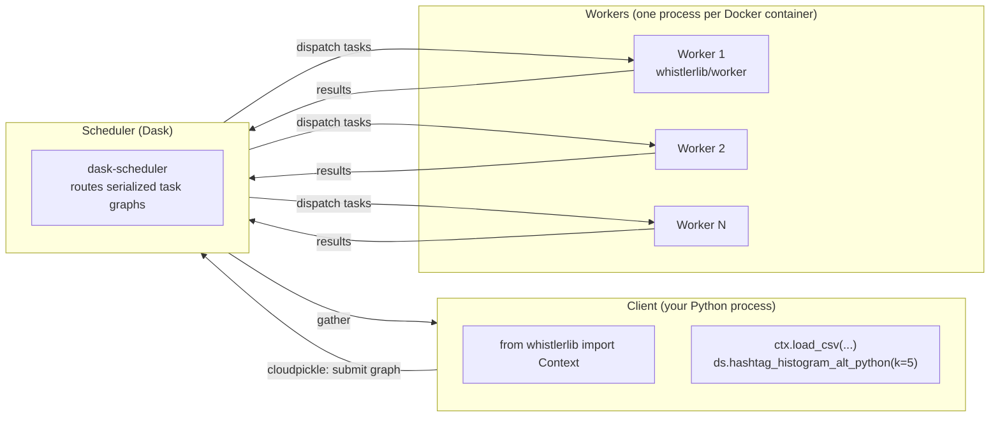
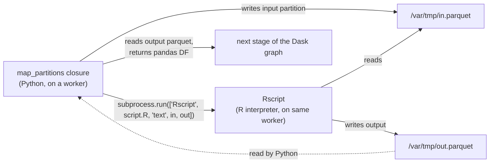
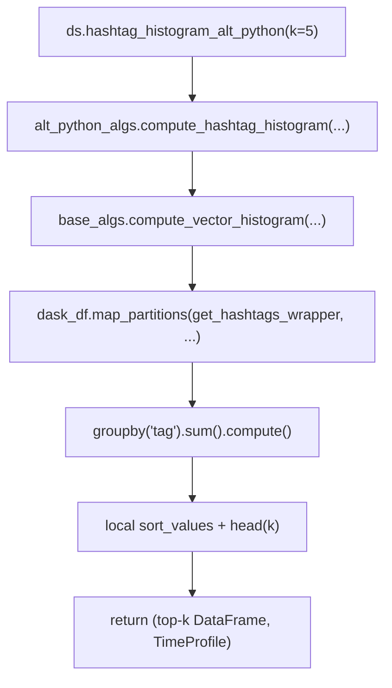

# Architecture

Whistlerlib is a thin Python library sitting on top of a Dask cluster. The library itself is small (a few hundred lines, four algorithm families). The interesting part is **what runs where**: and the answer is "almost everything on the workers."

## The three-tier picture

- **Client**: your laptop, a Jupyter kernel, a CI runner. Builds a Dask task graph by chaining `Context` and `TweetDataset` methods. Calls `.compute()` (directly or via a histogram/range/coonet wrapper) to materialize a result.
- **Scheduler**: a single Dask process. Routes serialized task graphs (cloudpickle bytes) from the client to workers and routes results back. Runs **no whistlerlib code**. Despite that, the scheduler image **does** include whistlerlib in its Python env, Dask requires consistent environments between client/scheduler/workers for serialization metadata.
- **Workers**: where every closure runs. Hashtag extraction, n-gram tokenization, sentiment scoring, R subprocesses, igraph edge dedup, all on workers.

## Why R lives only in the worker image

The R-backed algorithms (`hashtag_histogram_r`, `sentiment_histogram_and_sum_r`, …) shell out to `Rscript` from inside the per-partition closure. That closure runs on the worker, so R only needs to exist on the worker.

The host machine running the client never needs R. The scheduler never needs R. The whole R install, interpreter, system libs (`libarrow-dev`), and ~10 R packages, is baked into `whistlerlib/worker`.

See `whistlerlib.dask.r_algs.funcs.r_script_process.RScriptProcess` for the subprocess wrapper. Exit code `123` is a special "empty output, return empty DataFrame" signal, anything else propagates as `CalledProcessError`.

## How a query becomes work

A single call like `ds.hashtag_histogram_alt_python(k=5)` triggers:

Step **D** is the only distributed step in the histogram path: each partition runs `get_hashtags_wrapper` independently on a worker, producing a partial `(tag, freq)` table. Steps **E** + **F** are run by Dask's `compute()`: a distributed groupby/sum merges the partial tables, then the small result is `sort_values`'d locally on the client.

All four base primitives, `compute_vector_histogram`, `compute_vector_range`, `compute_matrix_nz_histogram_and_sum`, `compute_weighted_coonet`, follow this "distributed map_partitions → distributed groupby/agg → local sort" shape. See [Algorithm families](algorithm-families.md) for which user-facing method funnels into which primitive.

## The `processes` mode

The first arg to `Context(...)` is the Dask client mode. Whistlerlib defaults to `'processes'`, which configures Dask to launch one worker process per CPU. For the published Docker images, each worker container already runs one worker process with the threads-per-worker count set in `Dockerfile.worker`; passing `'processes'` from the client is a no-op against a remote cluster.

## Deployment topologies

| Topology | Scheduler | Workers | Used for |
|---|---|---|---|
| `LocalCluster` (Dask's in-process cluster) | in your client process | threads/processes in your client process | unit + integration tests; quick local dev with no Docker |
| Docker Compose | `whistlerlib-master` container on the same host | N×`worker` containers on the same host | local end-to-end testing; researcher's laptop |
| Docker Swarm | one manager-node container | N×worker-node containers across the swarm | production deployment |

The user-visible code is **identical** across all three. You change the host/port passed to `Context(...)`, and Dask handles the wire protocol the same way.
