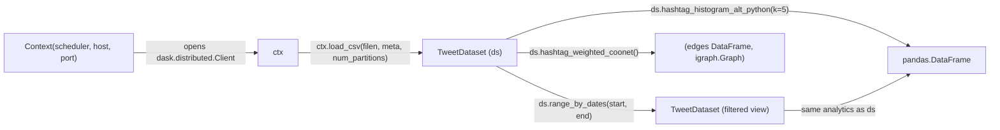

# Context and datasets

Whistlerlib's public surface is two classes: `Context` and `TweetDataset`. You always go `Context → TweetDataset → analytic`. There is no other entry point.



## `Context`, your connection to a Dask cluster

```python
from whistlerlib import Context

ctx = Context('processes', '127.0.0.1', 8786)
```

| Parameter | What it is |
|---|---|
| `dask_scheduler` | The Dask scheduler **mode** to set via `dask.config.set(scheduler=...)`. Whistlerlib's reference deployment passes `'processes'`. |
| `dask_scheduler_host` | Hostname or IP of the scheduler. `'127.0.0.1'` for local Docker Compose; the manager-node DNS name for Swarm. |
| `dask_scheduler_port` | TCP port (Dask default: `8786`). |

What `__init__` actually does:

1. Stores the three args.
2. Calls `dask.config.set(scheduler=...)`.
3. Opens a `dask.distributed.Client(f'{host}:{port}')`, a real TCP connection, immediately.
4. Instantiates a `DatasetRepositoryClient` for CSV loading.

> **The scheduler must already be reachable when you construct `Context`.** No retry, no fallback. Set up your cluster before instantiating.

`Context` is currently a single-cluster handle. Multiple contexts in the same process work but are unusual.

## `load_csv`, wrap a CSV in a Dask DataFrame

```python
ds = ctx.load_csv(
    filen='posts.csv',
    meta={
        'column_mapping': {'date_column': 'Date', 'text_column': 'text'},
        'file_encoding': 'utf-8',
    },
    num_partitions=8,
)
```

| Field | Required | Notes |
|---|---|---|
| `filen` | yes | A **path the workers can see**. With the published Docker Compose stack, `/tmp` on the host is bind-mounted into each worker, so a `tempfile.NamedTemporaryFile` written from the client works. For Swarm or other deployments, configure your own shared mount. |
| `meta['column_mapping']['date_column']` | yes | Name of the date column in the CSV. Forced to tz-naive by the loader. |
| `meta['column_mapping']['text_column']` | yes | Name of the text column. Only these two columns are read; everything else is ignored. |
| `meta['file_encoding']` | yes | Passed straight to `dask.dataframe.read_csv(..., encoding=...)`. |
| `num_partitions` | no, default `1` | Repartitions the resulting DataFrame to this many partitions. Pick something around your worker count × 2-4. |

Returns a [`TweetDataset`](#tweetdataset-the-analytic-surface).

The loader only reads **the two columns named in `column_mapping`** to keep memory predictable across very large CSVs. Other columns in the file are skipped, not stored.

## `TweetDataset`, the analytic surface

A `TweetDataset` wraps a Dask DataFrame plus metadata (column names, partition count, optional date range). Every analytic method dispatches to one of the four algorithm families, see [Algorithm families](algorithm-families.md).

The shape of every analytic method follows the same pattern:

```python
def hashtag_histogram_alt_python(self, k, distributed_sorting=False, return_time_profile=False):
    df_out, time_profile = alt_python_algs.compute_hashtag_histogram(...)
    if return_time_profile:
        return df_out, time_profile
    else:
        return df_out
```

So every method takes an optional `return_time_profile=True` flag to return a per-stage timing breakdown alongside the result, useful when tuning partition counts or comparing alt-python vs R implementations.

### Method catalogue

Frequency analytics:

- `hashtag_histogram_alt_python(k, ...)` / `hashtag_histogram_r(k, ...)`
- `mention_histogram_alt_python(k, ...)` / `mention_histogram_r(k, ...)`
- `ngram_histogram_alt_python(n, k, lan, w, ...)` / `ngram_histogram_r(n, k, ...)`

Sentiment:

- `sentiment_range_spanish_alt_python(left_end, right_end, ...)`, keep posts whose Spanish sentiment score falls in `[left_end, right_end]`.
- `sentiment_histogram_and_sum_r(language, method, ...)`, non-zero counts and score sums per emotion via the `syuzhet` R package.

Networks:

- `hashtag_weighted_coonet(...)`, returns `(edges_df, igraph.Graph)`.
- `mention_weighted_coonet(...)`, same but for mentions.

Bookkeeping:

- `tweet_count()`, row count of the current view (distributed).
- `repartition(num_partitions)`, change the partition count in place.
- `get_num_partitions()`, read the partition count.
- `group_by_date()`, group rows by `date_column`.
- `range_by_dates(start_date, end_date)`, return a **new** `TweetDataset` covering just that date range (the original is unchanged).

### Derived datasets preserve identity

`range_by_dates` returns a new `TweetDataset` carrying its own metadata (`ranged=True`, `range_start_date`, `range_end_date`). Analytics methods on a ranged dataset behave identically, they just operate on fewer rows.

The library used to use these flags to deduplicate `dask_sql` table names per derived view. That SQL surface was removed in `0.2.0` (see the [Migration guide](../migration/from-0.1.0.md)), but the flags stayed because downstream callers may still inspect them.

## Next

- [Algorithm families](algorithm-families.md), how `*_alt_python` and `*_r` dispatch through the four primitives.
- [Tutorial 01](../tutorials/01-quickstart-hashtag-histogram.md), end-to-end run of the most common analytic.
