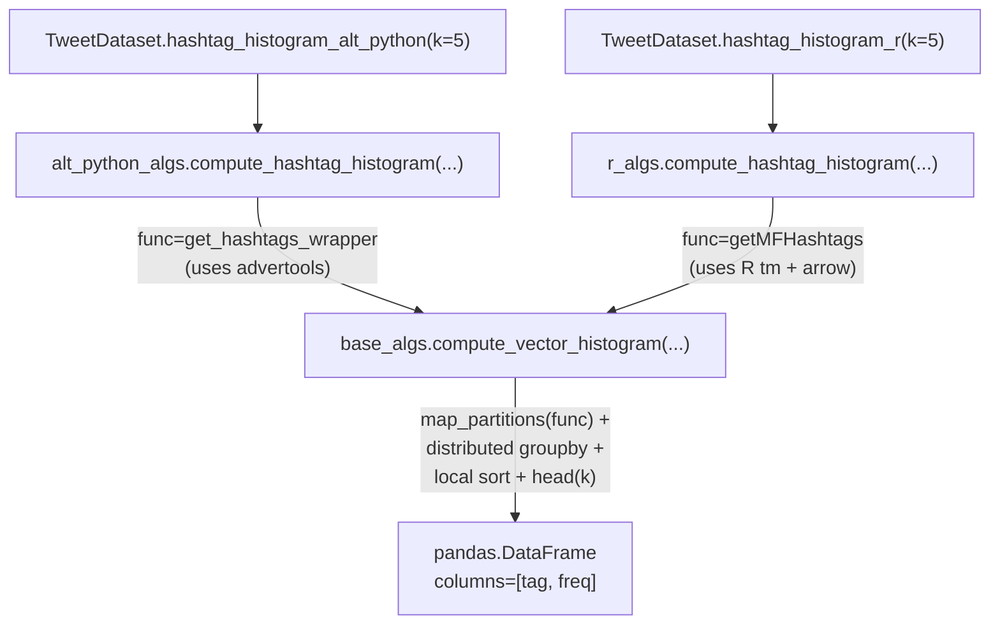

# Algorithm families

Whistlerlib's analytical surface is organized into four families. Each family is a Python sub-package under `whistlerlib.dask`:

| Family | Sub-package | Role |
|---|---|---|
| `base_algs` | `whistlerlib.dask.base_algs` | **The Dask primitives.** Four functions: `compute_vector_histogram`, `compute_vector_range`, `compute_matrix_nz_histogram_and_sum`, `compute_weighted_coonet`. Where the actual `map_partitions` + `groupby` + `sort` logic lives. Never called directly by users. |
| `alt_python_algs` | `whistlerlib.dask.alt_python_algs` | **Pure-Python algorithm implementations.** Wraps `advertools`, `nltk`, `sentiment-analysis-spanish`, `sklearn.feature_extraction.text` per partition. |
| `r_algs` | `whistlerlib.dask.r_algs` | **R-bridged implementations.** Wraps third-party R libraries (`tm`, `syuzhet`, `RWeka`, `radvertools`) via `Rscript` subprocess calls per partition. |
| `coonet_algs` | `whistlerlib.dask.coonet_algs` | **Co-occurrence network builders.** Wraps `base_algs.compute_weighted_coonet` and converts the result to `igraph.Graph`. |

## The two-layer dispatch

Every user-facing method on `TweetDataset` is a thin wrapper that calls one of the four `base_algs` primitives via either `alt_python_algs` or `r_algs`:

The split is intentional: `base_algs` knows nothing about *what* a token is. It receives a per-partition callable, calls it via `map_partitions`, and aggregates the resulting `(token, freq)` tables. The token-extraction strategy is plugged in at the call site:

- `alt_python_algs` plugs in `get_hashtags_wrapper`, which uses `advertools.extract_hashtags`.
- `r_algs` plugs in `getMFHashtags`, which shells out to `getMFHashtags.R` running R's `tm` package.

Both produce identically-shaped output. You pick by which extractor you trust for the domain.

## Mapping methods to primitives

| `TweetDataset` method | Family | Calls | base primitive |
|---|---|---|---|
| `hashtag_histogram_alt_python` | `alt_python_algs` | `get_hashtags_wrapper` | `compute_vector_histogram` |
| `hashtag_histogram_r` | `r_algs` | `getMFHashtags` (R subprocess) | `compute_vector_histogram` |
| `mention_histogram_alt_python` | `alt_python_algs` | `get_mentions_wrapper` | `compute_vector_histogram` |
| `mention_histogram_r` | `r_algs` | `getMentions` (R subprocess) | `compute_vector_histogram` |
| `ngram_histogram_alt_python` | `alt_python_algs` | `get_ngrams_wrapper` (uses sklearn `CountVectorizer`) | `compute_vector_histogram` |
| `ngram_histogram_r` | `r_algs` | `getNgrams` (R subprocess, RWeka tokenizer) | `compute_vector_histogram` |
| `sentiment_range_spanish_alt_python` | `alt_python_algs` | `get_sentiment_score_wrapper` (uses sentiment-analysis-spanish) | `compute_vector_range` |
| `sentiment_histogram_and_sum_r` | `r_algs` | `getSentiments` (R subprocess, syuzhet) | `compute_matrix_nz_histogram_and_sum` |
| `hashtag_weighted_coonet` | `coonet_algs` | `get_hashtag_coonet_edges` | `compute_weighted_coonet` |
| `mention_weighted_coonet` | `coonet_algs` | `get_mention_coonet_edges` | `compute_weighted_coonet` |

## The four base primitives

### `compute_vector_histogram(df, k, func, token_col, freq_col, ...)`

Generic distributed top-`k` over `(token, freq)` pairs. Every `*_histogram_*` method funnels here.

- `map_partitions(func, text_column, **kwargs)` → per-partition `(token, freq)` DataFrames.
- `groupby(token_col).sum()` → merged frequencies.
- Top-`k` by frequency (local `nlargest` for small `k`; distributed `nlargest` when `distributed_sorting=True`).

The `distributed_sorting=True` branch is documented to produce **non-deterministic ordering within tie groups**: if two tokens both have freq 7, which one comes first depends on partition count. Use `distributed_sorting=False` (the default) for reproducible output.

### `compute_vector_range(df, left_end, right_end, func, ...)`

Per-row score → keep rows whose score lies in `[left_end, right_end]`. Used by `sentiment_range_spanish_alt_python`.

- `map_partitions(func, ...)` → per-row `(text, score)` DataFrames.
- Boolean mask `(score >= left_end) & (score <= right_end)` → filtered DataFrame.

### `compute_matrix_nz_histogram_and_sum(df, func, meta, col_names, ...)`

For multi-column score outputs (e.g. one column per emotion, like `syuzhet` produces). Used by `sentiment_histogram_and_sum_r`.

- `map_partitions(func, ...)` → per-row multi-column score DataFrames.
- For each column in `col_names`: count non-zero rows; sum values.
- Output is a tiny `(emotion, count, sum)` DataFrame, sorted by `count` descending.

### `compute_weighted_coonet(df, func, source_col, target_col, weight_col, ...)`

Builds the weighted edge list and node list for a co-occurrence network. Used by both coonet wrappers.

- `map_partitions(func, ...)` → per-partition `(source, target, weight)` DataFrames.
- `groupby([source, target]).weight.sum()` → deduplicated, weight-merged edges.
- Concat sources + targets, drop duplicates → node list.
- Sort edges by `(source, target)` and nodes alphabetically → **deterministic output regardless of partition count**.

The `coonet_algs.to_graph(nodes, edges, weights)` helper turns the three lists into an `igraph.Graph`.

## When to pick `*_alt_python` vs `*_r`

| You should pick | When |
|---|---|
| `*_alt_python` | You want zero R install. You're running on a host without the worker Docker image. The Python implementations cover hashtags, mentions, n-grams, and Spanish sentiment well. |
| `*_r` | You want a specific behaviour from an R library you trust, `tm`-style hashtag tokenization, `syuzhet`-style emotion vectors, `RWeka` n-grams. R-bridge methods are only callable against a cluster running the `albertogarob/whistlerlib` image (R isn't available otherwise). |

The output schemas are matched between `*_alt_python` and `*_r` versions of the same analytic, so you can swap one for the other in a downstream pipeline without changing the consumer.
