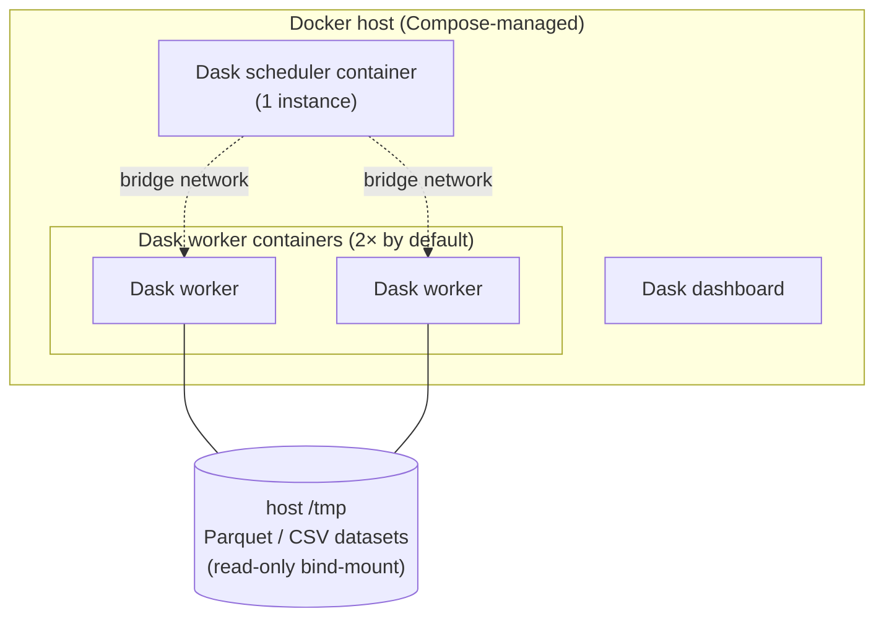
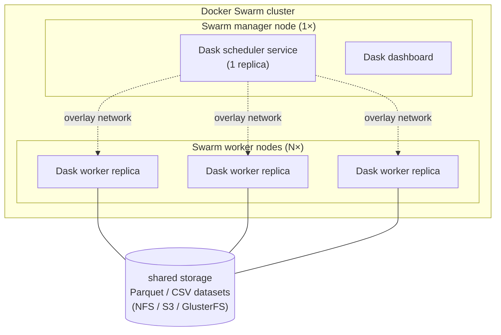

# Install with Docker

Whistlerlib ships **one custom Docker image**: `albertogarob/whistlerlib`, that runs both worker and scheduler roles in a Dask cluster. R and every R library the R-bridge calls (`tm`, `syuzhet`, `radvertools`, `RWeka`, …) are baked in, so your host never installs R.

Two deployment shapes are supported out of the box:

| Use case | Tool | File |
|---|---|---|
| Local dev / single-host smoke testing | Docker Compose | `docker/docker-compose.yml` |
| Production multi-node | Docker Swarm | `docker/stack.yml` |

The image is the same. The orchestration differs.

## Image roles

| Role | Image | Notes |
|---|---|---|
| Scheduler ("master") | `albertogarob/whistlerlib:<version>` with the entrypoint overridden to `dask-scheduler` | The scheduler runs no whistlerlib algorithm code, but Dask requires consistent Python environments between client / scheduler / workers for task-graph serialization. We reuse the worker image rather than publish a second lean one. |
| Worker | `albertogarob/whistlerlib:<version>` | Where every algorithm closure (alt-python and R-bridge) actually runs. |
| Client | Whatever Python env you have | `pip install whistlerlib` and connect via `Context(...)`. See [pip installation](/docs/installation/pip). |

See [Architecture](/docs/concepts/architecture) for the why behind this split.

## Image tags

| Tag | When | What |
|---|---|---|
| `latest` | each tagged release | most recent published version (don't pin to this in production) |
| `<major>.<minor>` | each tagged release | floating tag for that minor line |
| `<major>.<minor>.<patch>` | each tagged release | pinned version |
| `dev-<sha>` | manual `workflow_dispatch` runs in CI | development builds (never auto-tagged as `latest`) |

For reproducibility, pin to `<major>.<minor>.<patch>` in production.

---

## Local cluster with Docker Compose

The fast path: one host, scheduler + N workers managed by Compose.

### Topology



### 1. Bring it up

```bash
# From the repo root (clone first if you don't have it):
docker compose -f docker/docker-compose.yml up -d
```

This pulls `albertogarob/whistlerlib:latest` from Docker Hub on first run and brings up:

- A scheduler container on `tcp://localhost:8786`.
- A dashboard at `http://localhost:8787` (port parametrized via `DASK_DASHBOARD_HOST_PORT`).
- Two worker containers connected to the scheduler.

To pin to a specific version instead of `latest`:

```bash
WHISTLERLIB_TAG=0.2.0 docker compose -f docker/docker-compose.yml up -d
```

To use a locally-built image (for hacking on `Dockerfile.worker`):

```bash
docker build -f docker/Dockerfile.worker -t albertogarob/whistlerlib:dev .
WHISTLERLIB_TAG=dev docker compose -f docker/docker-compose.yml up -d
```

### 2. Verify

```bash
docker compose -f docker/docker-compose.yml \
    run --rm worker python /app/smoke.py master 8786
```

You should see something like `Workers: 2`, then a small pandas DataFrame.

### 3. Connect from the host

```python
from whistlerlib import Context

ctx = Context('processes', 'localhost', 8786)
# ... ds = ctx.load_csv(...) ...
```

The Compose file bind-mounts host `/tmp` into each worker as **read-only**, so a CSV written by the client (via `tempfile.NamedTemporaryFile`) is visible to workers under the same path. For non-trivial data, configure your own mount, edit `docker/docker-compose.yml` and add a `volumes:` entry mounting your data directory into each worker.

### 4. Scale workers

```bash
docker compose -f docker/docker-compose.yml up -d --scale worker=4
```

### 5. Tear down

```bash
docker compose -f docker/docker-compose.yml down
```

---

## Production cluster with Docker Swarm

Swarm is the production target. The workflow has more moving parts than Compose, but it's a one-time setup per cluster.

### Topology



### Prerequisites

- ≥2 Linux hosts with Docker Engine ≥ 20.10.
- Network reachability between every node on:
  - **2377/tcp**: cluster management.
  - **7946/tcp + 7946/udp**: node communication / gossip.
  - **4789/udp**: overlay-network data plane.
  - **8786/tcp**: Dask scheduler (clients → manager).
  - **8787/tcp**: dashboard (optional; firewall this if exposed publicly).
- A way for every node to **pull the `albertogarob/whistlerlib` image**: either Docker Hub (default for public images) or a private registry. See [Image distribution](#3-image-distribution).
- A **shared filesystem** workers can read data from. See [Shared storage](#4-shared-storage).

### 1. Initialize the swarm

On the **manager** node (this becomes the lead manager):

```bash
docker swarm init --advertise-addr <MANAGER-PUBLIC-IP>
```

The output prints a `docker swarm join --token …` command. Save it.

On each **worker** node, run the join command:

```bash
docker swarm join --token <WORKER-TOKEN> <MANAGER-PUBLIC-IP>:2377
```

Verify from the manager:

```bash
docker node ls
# Expect: 1 manager (Leader), N workers (Ready, Active).
```

### 2. Label the worker nodes

The stack file places workers on nodes with `node.role==worker`. That's set automatically by `swarm join`; you don't have to do anything. **However**, `stack.yml` also has an optional `preferences: spread: node.labels.zone` directive to evenly distribute workers across availability zones. If you want that spread, label your worker nodes:

```bash
docker node update --label-add zone=us-east-1a worker-node-1
docker node update --label-add zone=us-east-1b worker-node-2
# ...
```

If you don't set `zone` labels, the `spread` directive is silently ignored, Swarm just uses default scheduling.

### 3. Image distribution

Swarm pulls the image **on every node that runs a service replica**. You have three options:

**Option A: Docker Hub (default, recommended once published).** Once `albertogarob/whistlerlib:<version>` is published to Docker Hub (Phase 7), every node just pulls it:

```bash
# Nothing to do, `docker stack deploy` triggers the pulls.
```

**Option B: Private registry.** If you have a private registry (Harbor, ECR, GitLab Container Registry, …):

```bash
# Tag the locally-built image for your registry:
docker tag albertogarob/whistlerlib:dev myregistry.example.com/albertogarob/whistlerlib:0.2.0
docker push myregistry.example.com/albertogarob/whistlerlib:0.2.0
# Then in stack.yml change the `image:` to point at the registry, and
# log every node into the registry: docker login myregistry.example.com
```

**Option C: Manual transfer (offline / air-gapped).** Save and load:

```bash
# On a build host:
docker save albertogarob/whistlerlib:0.2.0 | gzip > whistlerlib-worker-0.2.0.tar.gz

# Copy to every swarm node, then on each:
zcat whistlerlib-worker-0.2.0.tar.gz | docker load
```

### 4. Shared storage

Workers need to be able to read the data the client wants to process. Three patterns:

**Pattern A: NFS / shared filesystem mount on every node.** The classical approach. Mount the same NFS export at the same path on every node (e.g. `/mnt/data`), then add a bind mount in `stack.yml`:

```yaml
services:
  worker:
    volumes:
      - /mnt/data:/data:ro
```

The client then loads CSVs by path `/data/posts.csv`.

**Pattern B: Object storage (S3 / GCS / MinIO).** Skip filesystem mounts entirely. Read CSVs through `fsspec`-compatible URLs:

```python
ds = ctx.load_csv(filen='s3://my-bucket/posts.csv', meta=..., num_partitions=8)
```

Workers need credentials. Pass them via environment variables in `stack.yml`:

```yaml
services:
  worker:
    environment:
      AWS_ACCESS_KEY_ID: ${AWS_ACCESS_KEY_ID}
      AWS_SECRET_ACCESS_KEY: ${AWS_SECRET_ACCESS_KEY}
      AWS_DEFAULT_REGION: ${AWS_DEFAULT_REGION}
```

For credentials you don't want in env vars, use `docker secret` and read them in via the worker entrypoint.

**Pattern C: In-cluster volume driver.** GlusterFS, Ceph, Portworx, … any Docker volume driver that gives you a multi-host volume. Add the volume to `stack.yml` under `volumes:`.

### 5. Configure the stack

The shipped `docker/stack.yml` has sensible defaults. Override via env vars:

- `VERSION`, image tag to pull (defaults to `latest`; **pin in production**).

Edit the file for things that aren't parametrized, `replicas`, `volumes`, `environment`, additional service configs.

### 6. Deploy

From the manager node:

```bash
VERSION=0.2.0 docker stack deploy -c docker/stack.yml whistlerlib
```

Verify:

```bash
docker stack services whistlerlib
# Expect: 2 services, master (1/1), worker (4/4)

docker service logs whistlerlib_master --since 1m
# Look for: "Scheduler at: tcp://...:8786"

docker service logs whistlerlib_worker --since 1m
# Look for: "Registered to: tcp://master:8786"
```

### 7. Connect a client

From any host that can reach `<MANAGER-PUBLIC-IP>:8786`:

```python
from whistlerlib import Context

ctx = Context('processes', '<MANAGER-PUBLIC-IP>', 8786)
```

For multi-host cluster + multi-user client access, you typically:

- Bind 8786 to the manager's private network only and use a VPN, **or**
- Run the client also as a Swarm service inside the same overlay network and never expose 8786 publicly.

### 8. Scale workers

```bash
docker service scale whistlerlib_worker=10
```

Swarm spins up additional worker containers on the labelled worker nodes. They connect to the scheduler over the overlay network and start accepting tasks.

### 9. Rolling update

When a new worker image lands:

```bash
VERSION=0.3.0 docker stack deploy -c docker/stack.yml whistlerlib
```

Swarm pulls the new image and replaces containers one by one (default strategy). For a production policy with health checks, add a `update_config:` block under `deploy:` in `stack.yml`:

```yaml
update_config:
  parallelism: 1
  delay: 30s
  failure_action: rollback
  monitor: 30s
```

### 10. Tear down

```bash
docker stack rm whistlerlib
```

This removes services and the overlay network. The image stays on each node (`docker image prune` to reclaim space). The swarm itself stays initialized; `docker swarm leave --force` on each node to dissolve it.

### Health-check tips

- **Scheduler not reachable from a node**: ensure the overlay network port 4789/udp isn't blocked. Most firewall surprises are here.
- **Workers connect, then drop**: usually a Python environment mismatch, verify all nodes are pulling the **same** `albertogarob/whistlerlib:<tag>`. The bare-`latest` tag floats; pin to `<x.y.z>` in production.
- **`docker service logs whistlerlib_worker` shows R errors**: see [Architecture](/docs/concepts/architecture), R bridge section. The worker image bakes in R + libraries; if you've built a custom image and stripped something, the R bridge will fail.

---

## Building the image locally

If you want to build the image yourself (you're hacking on `Dockerfile.worker`, you're doing offline distribution, or you don't trust the Docker Hub copy):

```bash
docker build -f docker/Dockerfile.worker -t albertogarob/whistlerlib:dev .
```

The first build takes about 5 to 10 minutes (R + Posit binary R wheels + `radvertools` from GitHub + `uv sync`). Subsequent builds are cached layer-by-layer and finish in seconds unless you touched the R install or `uv.lock`.

For multi-arch builds (`linux/amd64` + `linux/arm64`):

```bash
docker buildx build --platform linux/amd64,linux/arm64 \
    -f docker/Dockerfile.worker \
    -t albertogarob/whistlerlib:dev .
```

## Next

- [Tutorial 01](/docs/tutorials/01-quickstart-hashtag-histogram), first end-to-end run against the local cluster.
- [Architecture](/docs/concepts/architecture), what the scheduler, workers, and R bridge actually do.
